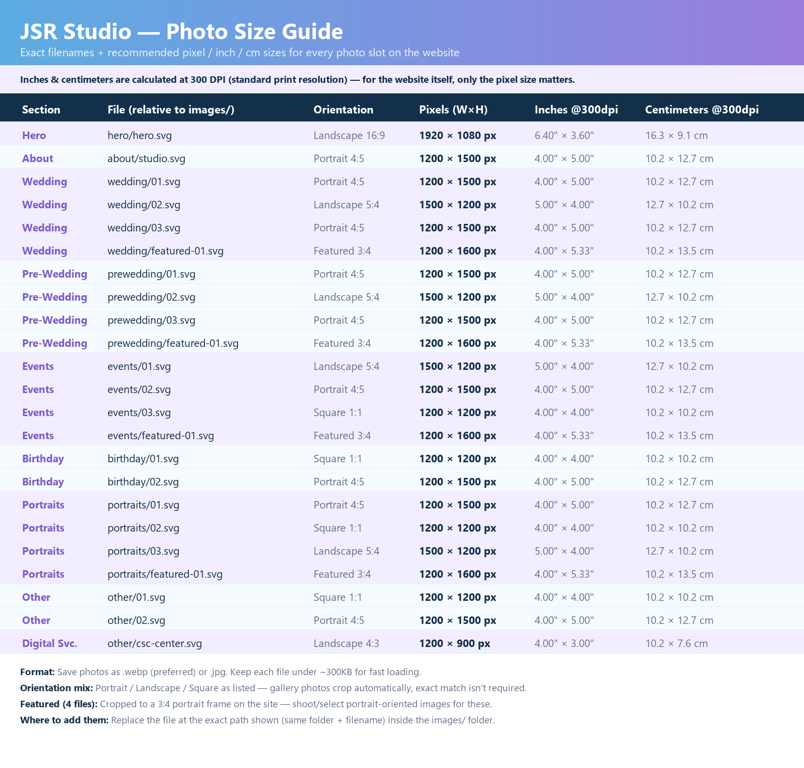

# JSR Studio — Photography Portfolio Website

A premium, modern, mobile-first static website for **JSR Studio**, a
photography studio and all-in-one Digital Service Centre based in Balikuda,
Jagatsinghpur, Odisha, India.

Live site (after GitHub Pages is enabled): `https://manoranjan2050.github.io/JSRstudio/`

Installable as an app on mobile home screens (PWA) — see
[CONFIG.md](CONFIG.md#pwa--installable-on-mobile).

---

## Tech Stack

Pure static site — **no backend, no build step**:

- HTML5
- CSS3 (custom sky-blue/lavender design system) + [Tailwind CSS](https://tailwindcss.com/) via CDN for utility touches
- Vanilla JavaScript (ES6+)
- [Google Fonts](https://fonts.google.com/) (Playfair Display + Inter)
- [Font Awesome](https://fontawesome.com/) (icon CDN)
- Web App Manifest + Service Worker (installable, works offline after first visit)

Works directly on **GitHub Pages**, any static host, or opened locally.

---

## Folder Structure

```
JSRstudio/
├── index.html              Main (and only) page
├── css/style.css           All styling
├── js/
│   ├── config.js           Studio info, contact, social links, stats — EDIT THIS FIRST
│   ├── gallery.js          Loads data/portfolio.json, renders gallery + lightbox
│   └── app.js               Header, mobile nav, animations, counters, testimonials
├── data/portfolio.json     Gallery + featured photo list — EDIT TO ADD PHOTOS
├── images/
│   ├── hero/                Hero background
│   ├── wedding/  prewedding/  events/  birthday/  portraits/  other/
│   └── about/                About-section photo
├── assets/logo/             Favicon / logo
└── docs: CONFIG.md, ARCHITECTURE.md, DEPLOYMENT.md, CHANGELOG.md, TODO.md
```

## Documentation

| File | Purpose |
|---|---|
| [CONFIG.md](CONFIG.md) | How to edit studio info, contact details, social links, colors, stats |
| [ARCHITECTURE.md](ARCHITECTURE.md) | How the site is structured and how the pieces fit together |
| [DEPLOYMENT.md](DEPLOYMENT.md) | GitHub Pages setup, custom domain setup |
| [CHANGELOG.md](CHANGELOG.md) | Version history |
| [TODO.md](TODO.md) | Outstanding tasks / future ideas |

---

## Quick Start (local preview)

No build step is required — just serve the folder statically (opening
`index.html` directly with `file://` will mostly work, but `fetch()` for
`data/portfolio.json` requires a local server in most browsers):

```bash
# Python
python -m http.server 8080

# or Node
npx serve .
```

Then open `http://localhost:8080`.

---

## Placeholder Photography — IMPORTANT

All images currently in `images/` are **generated placeholder graphics**
(blue-gradient SVGs with labels), not real photographs. No copyrighted or
downloaded images are included in this repository.

**Before going live, replace every placeholder with real JSR Studio photos.**
See "[How to add new photos](CONFIG.md#how-to-add-new-photos)" in CONFIG.md.

---

## Photo Size Guide

Exact filename + recommended pixel/inch/cm size for every photo slot on the
site — hand this to a photographer or anyone prepping images for the site.



| Section | File (relative to `images/`) | Orientation | Pixels (W×H) |
|---|---|---|---|
| Hero | `hero/hero.svg` | Landscape 16:9 | 1920 × 1080 |
| About | `about/studio.svg` | Portrait 4:5 | 1200 × 1500 |
| Wedding | `wedding/01.svg`, `03.svg` | Portrait 4:5 | 1200 × 1500 |
| Wedding | `wedding/02.svg` | Landscape 5:4 | 1500 × 1200 |
| Wedding | `wedding/featured-01.svg` | Featured 3:4 | 1200 × 1600 |
| Pre-Wedding | `prewedding/01.svg`, `03.svg` | Portrait 4:5 | 1200 × 1500 |
| Pre-Wedding | `prewedding/02.svg` | Landscape 5:4 | 1500 × 1200 |
| Pre-Wedding | `prewedding/featured-01.svg` | Featured 3:4 | 1200 × 1600 |
| Events | `events/01.svg` | Landscape 5:4 | 1500 × 1200 |
| Events | `events/02.svg` | Portrait 4:5 | 1200 × 1500 |
| Events | `events/03.svg` | Square 1:1 | 1200 × 1200 |
| Events | `events/featured-01.svg` | Featured 3:4 | 1200 × 1600 |
| Birthday | `birthday/01.svg` | Square 1:1 | 1200 × 1200 |
| Birthday | `birthday/02.svg` | Portrait 4:5 | 1200 × 1500 |
| Portraits | `portraits/01.svg` | Portrait 4:5 | 1200 × 1500 |
| Portraits | `portraits/02.svg` | Square 1:1 | 1200 × 1200 |
| Portraits | `portraits/03.svg` | Landscape 5:4 | 1500 × 1200 |
| Portraits | `portraits/featured-01.svg` | Featured 3:4 | 1200 × 1600 |
| Other | `other/01.svg` | Square 1:1 | 1200 × 1200 |
| Other | `other/02.svg` | Portrait 4:5 | 1200 × 1500 |
| Digital Service Centre | `other/csc-center.svg` | Landscape 4:3 | 1200 × 900 |

Inches/cm (at 300 DPI print resolution) are in the image above — for the
website itself only the pixel size matters. Full notes on format, file size
targets, and where each file goes: [CONFIG.md — How to Add New Photos](CONFIG.md#how-to-add-new-photos).

---

## Editing Cheat Sheet

| I want to... | Edit this file |
|---|---|
| Change phone / address / WhatsApp / social links / stats | `js/config.js` |
| Add, remove or reorder gallery photos | `data/portfolio.json` |
| Change colors | `css/style.css` (`:root` variables at the top) |
| Change page text/sections | `index.html` |
| Add a new portfolio category | See [CONFIG.md](CONFIG.md#how-to-add-a-new-portfolio-category) |
| Edit the Digital Service Centre list | `index.html` — see [CONFIG.md](CONFIG.md#how-to-edit-the-digital-service-centre-list) |
| Change the logo | `assets/logo/favicon.svg` — see [CONFIG.md](CONFIG.md#logo) |
| Update the contact QR code | `assets/qr/contact-qr.png` — see [CONFIG.md](CONFIG.md#contact-qr-code) |
| Change PWA app name/icons | `manifest.webmanifest` — see [CONFIG.md](CONFIG.md#pwa--installable-on-mobile) |

Full details for each of these are in [CONFIG.md](CONFIG.md).

---

## Deployment

See **[DEPLOYMENT.md](DEPLOYMENT.md)** for full GitHub Pages and custom
domain instructions.

---

## License / Usage

This code was built specifically for JSR Studio. Only publish photographs
that JSR Studio has the right to display publicly.
